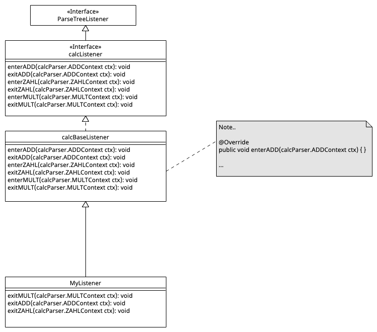
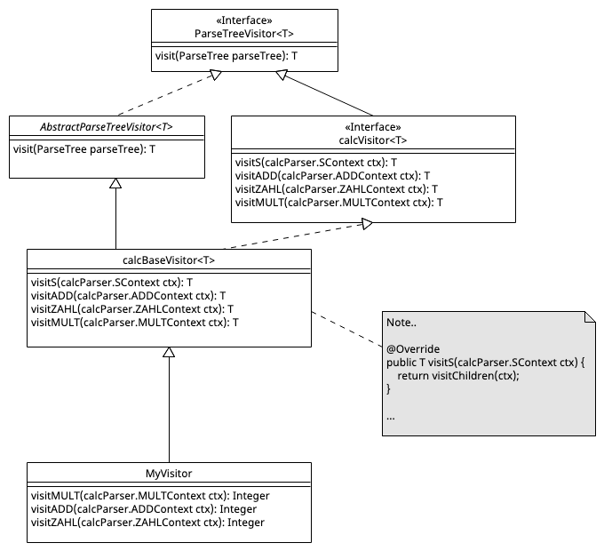

# Parser mit ANTLR generieren

> [!IMPORTANT]
>
> <details open>
>
> <summary><strong>🎯 TL;DR</strong></summary>
>
> Mit ANTLR kann aus einer Grammatik ein LL(\*)-Parser generiert werden.
> Die Parser-Regeln in der Grammatik fangen dabei mit einem
> **Kleinbuchstaben** an (Erinnerung: Lexer-Regel starten mit einem
> Großbuchstaben).
>
> Regeln haben einen Namen (linke Seite) und eine Produktion (rechte
> Seite). Dabei können beliebige Abfolgen von Lexer- und Parser-Regeln
> auf der rechten Seite einer Parser-Regel auftauchen. Die Token müssen
> jeweils matchen, die Parser-Regeln werden in einen Aufruf der
> jeweiligen generierten Funktion übersetzt.
>
> Parser-Regeln können aus mehreren Alternativen bestehen, diese werden
> per `|` separiert. Dabei hat bei Mehrdeutigkeiten die erste passende
> Alternative Vorrang. Wie bei Lexer-Regeln können Teile per `?` ein-
> oder keinmal vorkommen, per `*` beliebig oft oder per `+` ein- oder
> mehrfach.
>
> ANTLR erlaubt im Gegensatz zu allgemeinen LL-Parsern direkte
> Links-Rekursion. (Indirekte Links-Rekursion funktioniert allerdings
> nicht.)
>
> Der von ANTLR generierte Parser erzeugt auf der Eingabe einen
> Parse-Tree, der die Strukturen der Grammatik widerspiegelt: Die Token
> bilden die Blätter und jede erfolgreich durchlaufene Parser-Regel
> bildet einen entsprechenden Knoten im Baum.
>
> Für die Traversierung des Parse-Tree kann man die generierten
> Listener- oder Visitor-Klassen nutzen. Beim Einsatz der Listener nutzt
> man die vorgegebene Klasse `ParseTreeWalker`, die mit dem Parse-Tree
> und dem Listener den Baum per Tiefensuche traversiert und immer die
> jeweiligen `enterRegel`- und `exitRegel`-Methoden aufruft. Beim
> Visitor muss die Traversierung selbst erledigt werden, hier steht die
> aus der Klassenhierarchie geerbte Methode `visit` als Startpunkt zur
> Verfügung. In dieser Methode wird basierend auf dem Knotentyp die in
> den Visitor-Klassen implementierte `visitRegel`-Methode aufgerufen und
> man muss darauf achten, die Kindknoten durch passende Aufrufe zu
> traversieren. Sowohl bei den generierten Listener- als auch den
> Visitor-Klassen kann man die leeren Defaultmethoden bei Bedarf selbst
> überschreiben. Für den Zugriff auf die Regel-Elemente werden die
> sogenannten Kontextobjekte als Parameter übergeben.
>
> Benannte Alternativen und Regel-Elemente sind nützlich, weil für die
> benannten Alternativen zusätzliche Kontextklassen erzeugt werden, über
> die dann auf die Bestandteile der Alternativen zugegriffen werden
> kann. Außerdem werden zusätzlich passende `enterAlternative`- und
> `exitAlternative`- bzw. `visitAlternative`-Methoden generiert. Für
> benannte Regel-Elemente wird ein entsprechend benanntes Attribut im
> Kontextobjekt angelegt, welches `public` sichtbar ist.
> </details>

> [!TIP]
>
> <details open>
>
> <summary><strong>🎦 Videos</strong></summary>
>
> - [VL Parser mit ANTLR (YT)](https://youtu.be/YuUHBvPUS4k)
> - [Demo ANTLR Parser (YT)](https://youtu.be/FJOEPY-TMmw)
> - [VL Parser mit ANTLR
>   (HSBI)](https://www.hsbi.de/medienportal/m/19925b756d6fc934bfe0b5107eb5fa58373a53af49c690ebce86e15f2b212c89c80ea7665e42c78abdc8dfe0718ea46f6a9817eeba4ad1293bdb4c84f7c8f084)
>
> </details>

## Hello World

``` antlr
grammar Hello;

start : stmt* ;

stmt  : ID '=' expr ';' | expr ';' ;

expr  : term ('+' term)* ;
term  : atom ('*' atom)* ;

atom  : ID | NUM ;

ID    : [a-z][a-zA-Z]* ;
NUM   : [0-9]+ ;
WS    : [ \t\n]+ -> skip ;
```

<p align="right"><a href="https://github.com/Compiler-CampusMinden/CB-Vorlesung-Bachelor/blob/master/lecture/02-parsing/src/Hello.g4">Konsole: Hello (grun, Parse-Tree)</a></p>

### Starten des Parsers

1.  Grammatik übersetzen und Code generieren: `antlr Hello.g4`
2.  Java-Code kompilieren: `javac *.java`
3.  Parser ausführen:
    - `grun Hello start -tree` oder `grun Hello start -gui` (Grammatik
      “Hello”, Startregel “start”)

    - Alternativ mit kleinem Java-Programm:

      ``` java
      import org.antlr.v4.runtime.CharStreams;
      import org.antlr.v4.runtime.CommonTokenStream;
      import org.antlr.v4.runtime.tree.ParseTree;

      public class Main {
          public static void main(String[] args) throws Exception {
              HelloLexer lexer = new HelloLexer(CharStreams.fromStream(System.in));
              CommonTokenStream tokens = new CommonTokenStream(lexer);
              HelloParser parser = new HelloParser(tokens);

              ParseTree tree = parser.start();  // Start-Regel
              System.out.println(tree.toStringTree(parser));
          }
      }
      ```

### Startregeln

- `start` ist eine <span class="mark">Parser-Regel</span> =\> Eine
  Parser-Regel pro Grammatik wird benötigt, damit man den generierten
  Parser am Ende auch starten kann …
- Alle Regeln mit kleinem Anfangsbuchstaben sind Parser-Regeln
- Alle Regeln mit großem Anfangsbuchstaben sind Lexer-Regeln

### Formen der Subregeln

``` antlr
stmt  : ID '=' expr ';' ;
```

Um die Regel `stmt` anwenden zu können, müssen alle Elemente auf der
rechten Seite der Regel erfüllt werden. Dabei müssen die Token wie `ID`,
`=` und `;` matchen und die Subregel `expr` muss erfüllt werden können.
Beachten Sie das abschließende Semikolon am Ende einer ANTLR-Regel!

``` antlr
stmt  : ID '=' expr ';' | expr ';' ;
```

Alternativen werden durch ein `|` getrennt. Hier muss genau eine
Alternative erfüllt werden. Falls nötig, trennt man die Alternativen
durch Einschließung in runden Klammern vom Rest der Regel ab:
`r : a (b | c) d ;`.

``` antlr
expr  : term ('+' term)* ;
```

Der durch den `*` gekennzeichnete Teil kann beliebig oft vorkommen oder
auch fehlen. Bei einem `+` müsste der Teil mind. einmal vorkommen und
bei einem `?` entsprechend einmal oder keinmal.

Auch hier kann man die Operatoren durch ein zusätzliches `?` auf
non-greedy umschalten (analog zu den Lexer-Regeln).

(vgl.
[github.com/antlr/antlr4/blob/master/doc/parser-rules.md](https://github.com/antlr/antlr4/blob/master/doc/parser-rules.md#subrules))

### Reihenfolge in Grammatik definiert Priorität

Falls mehr als eine Parser-Regel die selbe Input-Sequenz matcht, löst
ANTLR diese Mehrdeutigkeit auf, indem es die erste Alternative nimmt,
die an der Entscheidung beteiligt ist.

``` antlr
start : stmt ;

stmt  : expr | ID  ;
expr  : ID   | NUM ;
```

Bei der Eingabe “foo” würde die Alternative `ID` in der Regel `expr`
“gewinnen”, weil sie in der Grammatik vor der Alternative `ID` in der
Regel `stmt` kommt und damit Vorrang hat.

### Parse-Tree

Betrachten wir erneut die obige Grammatik.

Die Eingabe von “`a = 42;`” führt zu folgendem Parse-Tree:

<picture><source media="(prefers-color-scheme: light)" srcset="images/hello_ex1_light.png"><source media="(prefers-color-scheme: dark)" srcset="images/hello_ex1_dark.png"></picture>

Diese Eingabe führt zur Erkennung der Token `[ID, WS, =, WS, NUM, ;]`,
wobei die `WS`-Token verworfen werden und der Parser den Tokenstream
`[ID, =, NUM, ;]` erhält.

Die Startregel hat auf der rechten Seite kein oder mehrere
`stmt`-Regeln. Die `stmt`-Regel fordert auf der rechten Seite entweder
die Token `ID`und `=` sowie die Regel `expr` gefolgt vom Token `;`, oder
die Regel `expr` gefolgt vom Token `;`. In unserem Beispiel kann für das
“a” das Token `ID` produziert werden, das “=” matcht ebenfalls. Die “42”
wird erklärt, indem für `expr` ein `term` und dort ein `atom` aufgerufen
wird. Für das `atom` muss entweder ein Token `ID` oder `NUM` als
nächstes Token kommen - hier wird die “42” wird als Token `NUM`
verarbeitet. Da die weiteren Regelteile in `term` und `expr` optional
sind, haben wir damit ein `expr` erfüllt und das nachfolgende `;`-Token
schließt die erste Alternative der Regel `stmt` erfolgreich ab.

Im entstehenden Parse-Tree sind diese Abläufe und grammatikalischen
Strukturen direkt erkennbar. Jede erfolgreich durchlaufene Parserregel
wird zu einem Knoten im Parse-Tree. Die Token werden als Terminale
(Blätter) in den Baum eingehängt.

*Anmerkung*: Der Parse-Tree ist das Ergebnis der Parsers-Phase im
Compiler und dient damit als Input für die folgenden Compilerstufen. In
der Regel benötigt man die oft recht komplexen Strukturen aber später
nicht mehr und vereinfacht den Baum zu einem *Abstract Syntax Tree*
(AST). Im Beispiel könnte man den Zweig `stmt - expr - term - atom - 42`
zu `stmt - 42` vereinfachen.

Betrachten wir nun die Eingabe `foo = 2+3*4; bar = 3*4+2;`. Diese führt
zu folgendem Parse-Tree:

<picture><source media="(prefers-color-scheme: light)" srcset="images/hello_ex2_light.png"><source media="(prefers-color-scheme: dark)" srcset="images/hello_ex2_dark.png"></picture>

Wie man sehen kann, sind in der Grammatik die üblichen Vorrangregeln für
die Operationen `+` und `*` berücksichtigt - die Multiplikation wird in
beiden Fällen korrekt “unter” der Addition im Baum eingehängt.

### To EOF not to EOF?

Startregeln müssen nicht unbedingt den gesamten Input “konsumieren”. Sie
müssen per Default nur eine der Alternativen in der Startregel erfüllen.

Betrachten wir noch einmal einen leicht modifizierten Ausschnitt aus der
obigen Grammatik:

``` antlr
start : stmt ;
```

Die Startregel wurde so geändert, dass sie nur noch genau ein Statement
akzeptieren soll.

In diesem Fall würde die Startregel bei der Eingabe “aa; bb;” nur den
ersten Teil “aa;” konsumieren (als Token `ID`) und das folgende “bb;”
ignorieren. Das wäre in diesem Fall aber auch kein Fehler.

Wenn der gesamte Eingabestrom durch die Startregel erklärt werden soll,
dann muss das vordefinierte Token `EOF` am Ende der Startregel
eingesetzt werden:

``` antlr
start : stmt EOF;
```

Hier würde die Eingabe “aa; bb;” zu einem Fehler führen, da nur der Teil
“aa;” durch die Startregel abgedeckt ist (Token `ID`), und der Rest
“bb;” zwar sogar ein gültiges Token wären (ebenfalls `ID` und `;`), aber
eben nicht mehr von der Startregel akzeptiert. Durch das `EOF` soll die
Startregel aber den gesamten Input konsumieren und erklären, was hier
nicht geht und entsprechend zum Fehler führt.

(vgl.
[github.com/antlr/antlr4/blob/master/doc/parser-rules.md](https://github.com/antlr/antlr4/blob/master/doc/parser-rules.md#start-rules-and-eof))

## Expressions und Vorrang (Operatoren)

Betrachten wir noch einmal den Ausschnitt für die Ausdrücke
(*Expressions*) in der obigen Beispielgrammatik:

``` antlr
expr  : term ('+' term)* ;
term  : atom ('*' atom)* ;
atom  : ID ;
```

Diese typische, etwas komplex anmutende Struktur soll sicher stellen,
dass die Vorrangregeln für Addition und Multiplikation korrekt beachtet
werden, d.h. dass `2+3*4` als `2+(3*4)` geparst wird und nicht
fälschlicherweise als `(2+3)*4` erkannt wird.

Zusätzlich muss bei LL-Parsern Links-Rekursion vermieden werden: Die
Parser-Regeln werden in Funktionsaufrufe übersetzt, d.h. bei einer
Links-Rekursion würde man die selbe Regel immer wieder aufrufen, ohne
ein Token aus dem Token-Strom zu entnehmen.

ANTLR (ab Version 4) kann mit beiden Aspekten automatisch umgehen:

- ANTLR kann direkte Linksrekursion automatisch auflösen. Die Regel
  `r : r T U | V ;` kann also in ANTLR verarbeitet werden.
- ANTLR besitzt einen Mechanismus zur Auflösung von Mehrdeutigkeiten.
  Wie oben geschrieben, wird bei der Anwendbarkeit von mehreren
  Alternativen die erste Alternative genutzt.

Damit lässt sich die typische Struktur für Expression-Grammatiken
deutlich lesbarer gestalten:

``` antlr
expr  : expr '*' expr
      | expr '+' expr
      | ID
      ;
```

Die Regel `expr` ist links-rekursiv, was normalerweise bei LL-Parsern
problematisch ist. ANTLR löst diese Links-Rekursion automatisch auf
(vgl.
[github.com/antlr/antlr4/blob/master/doc/left-recursion.md](https://github.com/antlr/antlr4/blob/master/doc/left-recursion.md)).

Da bei Mehrdeutigkeit in der Grammatik, also bei der Anwendbarkeit
mehrerer Alternativen stets die erste Alternative genommen wird, lassen
sich die Vorrangregeln durch die Reihenfolge der Alternativen in der
`expr`-Regel implementieren: Die Multiplikation hat Vorrang von der
Addition, und diese hat wiederum Vorrang von einer einfachen `ID`.

### Direkte vs. indirekte Links-Rekursion

ANTLR kann nur *direkte* Links-Rekursion auflösen. Regeln wie
`r : r T U | V ;` stellen in ANTLR also kein Problem dar.

*Indirekte* Links-Rekursion erkennt ANTLR dagegen nicht:

``` antlr
r : s T U | V ;
s : r W X ;
```

Hier würden sich die Regeln `r` und `s` gegenseitig aufrufen und kein
Token aus dem Tokenstrom entfernen, so dass der generierte LL-Parser
hier in einer Endlosschleife stecken bleiben würde. Mit indirekter
Links-Rekursion kann ANTLR nicht umgehen.

### Konflikte in Regeln

Wenn mehrere Alternativen einer Regel anwendbar sind, entscheidet sich
ANTLR für die erste Alternative.

Wenn sich mehrere Tokenregeln überlappen, “gewinnt” auch hier die zuerst
definierte Regel.

``` antlr
def : 'func' ID '(' ')' block ;

FOR : 'for' ;
ID  : [a-z][a-zA-Z]* ;
```

Hier werden ein implizites Token `'func'` sowie die expliziten Token
`FOR` und `ID` definiert. Dabei sind die Lexeme für `'func'` und `FOR`
auch in `ID` enthalten. Dennoch werden `'func'` und `FOR` erkannt und
nicht über `ID` gematcht, weil sie *vor* der Regel `ID` definiert sind.

Tatsächlich sortiert ANTLR die Regeln intern um, so dass alle
Parser-Regeln *vor* den Lexer-Regeln definiert sind. Die impliziten
Token werden dabei noch vor den expliziten Token-Regeln angeordnet. Im
obigen Beispiel hat also `'func'` eine höhere Priorität als `FOR`, und
`FOR` hat eine höhere Priorität als `ID`. Aus diesem Grund gibt es die
Konvention, die Parser-Regeln in der Grammatik vor den Lexer-Regeln zu
definieren - dies entspricht quasi der Anordnung, die ANTLR bei der
Verarbeitung sowieso erzeugen würde.

Aus diesem Grund würde auch eine Umsortierung der obigen Grammatik
funktionieren:

``` antlr
FOR : 'for' ;
ID  : [a-z][a-zA-Z]* ;

def : 'func' ID '(' ')' block ;
```

Intern würde ANTLR die Parser-Regel `def` wieder vor den beiden
Lexer-Regeln anordnen, und zwischen den Parser-Regeln und den
Lexer-Regeln die impliziten Token (hier `'func'`).

## Kontext-Objekte für Parser-Regeln

``` antlr
s    : expr         {List<EContext> x = $expr.ctx.e();}
     ;
expr : e '*' e ;
```

<picture><source media="(prefers-color-scheme: light)" srcset="images/ParserRuleContext_light.png"><source media="(prefers-color-scheme: dark)" srcset="images/ParserRuleContext_dark.png"></picture>

Jede Regel liefert ein passend zu dieser Regel generiertes
Kontext-Objekt zurück. Darüber kann man das/die Kontextobjekt(e) der
Sub-Regeln abfragen.

Die Regel `s` liefert entsprechend ein `SContext`-Objekt und die Regel
`expr` liefert ein `ExprContext`-Objekt zurück.

In der Aktion fragt man das Kontextobjekt über `ctx` ab, in den
Listener- und Visitor-Methoden erhält man die Kontextobjekte als
Parameter.

Für einfache Regel-Aufrufe liefert die parameterlose Methode nur ein
einziges Kontextobjekt (statt einer Liste) zurück.

**Anmerkung**: ANTLR generiert nur dann *Felder* für die Regel-Elemente
im Kontextobjekt, wenn diese in irgendeiner Form referenziert werden.
Dies kann beispielsweise durch Benennung (Definition eines Labels, siehe
nächste Folie) oder durch Nutzung in einer Aktion (siehe obiges
Beispiel) geschehen.

## Benannte Regel-Elemente oder Alternativen

``` antlr
stat  : 'return' value=e ';'    # Return
      | 'break' ';'             # Break
      ;
```

``` java
public static class StatContext extends ParserRuleContext { ... }
public static class ReturnContext extends StatContext {
    public EContext value;
    public EContext e() { ... }
}
public static class BreakContext extends StatContext { ... }
```

Mit `value=e` wird der Aufruf der Regel `e` mit dem Label `value`
belegt, d.h. man kann mit `$e.text` oder `$value.text` auf das
`text`-Attribut von `e` zugreifen. Falls es in einer Produktion mehrere
Aufrufe einer anderen Regel gibt, **muss** man für den Zugriff auf die
Attribute eindeutige Label vergeben.

Analog wird für die beiden Alternativen je ein eigener Kontext erzeugt.

## Arbeiten mit ANTLR-Listeners

ANTLR (generiert auf Wunsch) zur Grammatik passende Listener (Interface
und leere Basisimplementierung). Beim Traversieren mit dem
Default-`ParseTreeWalker` wird der Parse-Tree mit Tiefensuche abgelaufen
und jeweils beim Eintritt in bzw. beim Austritt aus einen/m Knoten der
passende Listener mit dem passenden Kontext-Objekt aufgerufen.

Damit kann man die Grammatik “für sich” halten, d.h. unabhängig von
einer konkreten Zielsprache und die Aktionen über die Listener (oder
Visitors, s.u.) ausführen.

``` antlr
expr : e1=expr '*' e2=expr      # MULT
     | e1=expr '+' e2=expr      # ADD
     | DIGIT                    # ZAHL
     ;
```

ANTLR kann zu dieser Grammatik `calc.g4` einen passenden Listener
(Interface `calcListener`) generieren (Option `-listener` beim Aufruf
von `antlr`). Weiterhin generiert ANTLR eine leere Basisimplementierung
(Klasse `calcBaseListener`):

<picture><source media="(prefers-color-scheme: light)" srcset="images/ParseTreeListener_light.png"><source media="(prefers-color-scheme: dark)" srcset="images/ParseTreeListener_dark.png"></picture>

(Nur “interessante” Methoden gezeigt.)

Von dieser Basisklasse leitet man einen eigenen Listener ab und
implementiert die Methoden, die man benötigt.

``` java
public static class MyListener extends calcBaseListener {
    public void exitMULT(calcParser.MULTContext ctx) {
        ...
    }
    public void exitADD(calcParser.ADDContext ctx) {
        ...
    }
    public void exitZAHL(calcParser.ZAHLContext ctx) {
        ...
    }
}
```

Anschließend baut man das alles in eine Traversierung des Parse-Trees
ein:

``` java
public class TestMyListener {
    public static class MyListener extends calcBaseListener {
        ...
    }

    public static void main(String[] args) throws Exception {
        calcLexer lexer = new calcLexer(CharStreams.fromStream(System.in));
        CommonTokenStream tokens = new CommonTokenStream(lexer);
        calcParser parser = new calcParser(tokens);

        ParseTree tree = parser.s();    // Start-Regel

        ParseTreeWalker walker = new ParseTreeWalker();
        MyListener eval = new MyListener();
        walker.walk(eval, tree);
    }
}
```

<p align="right"><a href="https://github.com/Compiler-CampusMinden/CB-Vorlesung-Bachelor/blob/master/lecture/02-parsing/src/TestMyListener.java">Beispiel: TestMyListener.java und calc.g4</a></p>

## Arbeiten mit dem Visitor-Pattern

ANTLR (generiert ebenfalls auf Wunsch) zur Grammatik passende Visitoren
(Interface und leere Basisimplementierung).

Hier muss man im Gegensatz zu den Listeners allerdings selbst für eine
geeignete Traversierung des Parse-Trees sorgen. Dafür hat man mehr
Freiheiten im Vergleich zum Einsatz von Listeners, insbesondere im
Hinblick auf Rückgabewerte.

``` antlr
expr : e1=expr '*' e2=expr      # MULT
     | e1=expr '+' e2=expr      # ADD
     | DIGIT                    # ZAHL
     ;
```

ANTLR kann zu dieser Grammatik einen passenden Visitor (Interface
`calcVisitor<T>`) generieren (Option `-visitor` beim Aufruf von
`antlr`). Weiterhin generiert ANTLR eine leere Basisimplementierung
(Klasse `calcBaseVisitor<T>`):

<picture><source media="(prefers-color-scheme: light)" srcset="images/ParseTreeVisitor_light.png"><source media="(prefers-color-scheme: dark)" srcset="images/ParseTreeVisitor_dark.png"></picture>

(Nur “interessante” Methoden gezeigt.)

Von dieser Basisklasse leitet man einen eigenen Visitor ab und
überschreibt die Methoden, die man benötigt. Wichtig ist, dass man
selbst für das “Besuchen” der Kindknoten sorgen muss (rekursiver Aufruf
der geerbten Methode `visit()`).

``` java
public static class MyVisitor extends calcBaseVisitor<Integer> {
    public Integer visitMULT(calcParser.MULTContext ctx) {
        return ...
    }
    public Integer visitADD(calcParser.ADDContext ctx) {
        return ...
    }
    public Integer visitZAHL(calcParser.ZAHLContext ctx) {
        return ...
    }
}
```

Anschließend baut man das alles in eine manuelle Traversierung des
Parse-Trees ein:

``` java
public class TestMyVisitor {
    public static class MyVisitor extends calcBaseVisitor<Integer> {
        ...
    }

    public static void main(String[] args) throws Exception {
        calcLexer lexer = new calcLexer(CharStreams.fromStream(System.in));
        CommonTokenStream tokens = new CommonTokenStream(lexer);
        calcParser parser = new calcParser(tokens);

        ParseTree tree = parser.s();    // Start-Regel

        MyVisitor eval = new MyVisitor();
        eval.visit(tree);
    }
}
```

<p align="right"><a href="https://github.com/Compiler-CampusMinden/CB-Vorlesung-Bachelor/blob/master/lecture/02-parsing/src/TestMyVisitor.java">Beispiel: TestMyVisitor.java und calc.g4</a></p>

## Eingebettete Aktionen und Attribute

``` antlr
s   : expr                      {System.err.println($expr.v);}
    ;

expr returns [int v]
    : e1=expr '*' e2=expr       {$v = $e1.v * $e2.v;}
    ;
```

Auch die Parser-Regeln können mit eingebetteten Aktionen ergänzt werden,
die in die (für die jeweilige Regel) generierte Methode eingefügt werden
und bei erfolgreicher Anwendung der Parser-Regel ausgeführt werden.

Über `returns [int v]` fügt man der Regel `expr` ein Attribut `v`
(Integer) hinzu, welches man im jeweiligen Kontext abfragen bzw. setzen
kann (agiert als Rückgabewert der generierten Methode). Auf diesen Wert
kann in den Aktionen mit `$v` zugegriffen werden.

*Anmerkung*: Durch den Einsatz von eingebetteten Aktionen und Attributen
wird die Grammatik abhängig von der Zielsprache des generierten
Lexers/Parsers!

## Ausblick

Damit haben wir die sprichwörtliche “Spitze des Eisbergs” gesehen. Mit
ANTLR sind noch viele weitere Dinge möglich. Bitte nutzen Sie aktiv die
Dokumentation auf
[github.com/antlr/antlr4](https://github.com/antlr/antlr4).

## Wrap-Up

Parser mit ANTLR generieren: Parser-Regeln werden mit
**Kleinbuchstaben** geschrieben

- Regeln können Lexer- und Parser-Regeln “aufrufen”
- Regeln können Alternativen haben
- Bei Mehrdeutigkeit: Vorrang für erste Alternative
- ANTLR erlaubt direkte Links-Rekursion
- ANTLR erzeugt Parse-Tree
- Benannte Alternativen und Regel-Elemente
- Traversierung des Parse-Tree: Listener oder Visitoren, Zugriff auf
  Kontextobjekte

## 📖 Zum Nachlesen

- Parr ([2014](#ref-Parr2014))

> [!NOTE]
>
> <details>
>
> <summary><strong>✅ Lernziele</strong></summary>
>
> - k2: Aufbau der Parser-Regeln
> - k3: Alternativen und optionale/mehrfache Regelteile in Parser-Regeln
> - k3: Vorrang von Alternativen (bei Mehrdeutigkeiten)
> - k3: Benannte Alternativen und Regel-Elemente
> - k2: Aufbau des Parse-Tree
> - k3: Umgang mit Kontext-Objekten
> - k3: Traversierung des Parse-Tree mit den generierten Listenern oder
>   Visitors
>
> </details>

> [!TIP]
>
> <details>
>
> <summary><strong>🏅 Challenges</strong></summary>
>
> **Lexer und Parser mit ANTLR: Programmiersprache Lox**
>
> Betrachten Sie folgenden Code-Schnipsel in der Sprache
> [“Lox”](https://www.craftinginterpreters.com/the-lox-language.html):
>
>     fun fib(x) {
>         if (x == 0) {
>             return 0;
>         } else {
>             if (x == 1) {
>                 return 1;
>             } else {
>                 fib(x - 1) + fib(x - 2);
>             }
>         }
>     }
>
>     var wuppie = fib(4);
>
> Erstellen Sie für diese fiktive Sprache einen Lexer+Parser mit ANTLR.
> Implementieren Sie mit Hilfe des Parse-Trees und der Listener oder
> Visitoren einen einfachen Pretty-Printer.
>
> (Die genauere Sprachdefinition finden Sie bei Bedarf unter
> [craftinginterpreters.com/the-lox-language.html](https://www.craftinginterpreters.com/the-lox-language.html).)
> </details>

------------------------------------------------------------------------

> [!NOTE]
>
> <details>
>
> <summary><strong>👀 Quellen</strong></summary>
>
> <div id="refs" class="references csl-bib-body hanging-indent">
>
> <div id="ref-Parr2014" class="csl-entry">
>
> Parr, T. 2014. *The Definitive ANTLR 4 Reference*. Pragmatic
> Bookshelf.
> <https://learning.oreilly.com/library/view/the-definitive-antlr/9781941222621/>.
>
> </div>
>
> </div>
>
> </details>

------------------------------------------------------------------------


Unless otherwise noted, this work is licensed under CC BY-SA 4.0.

<blockquote><p><sup><sub><strong>Last modified:</strong> f7ac9d2 (reformat using shorter lines, 2025-08-09)<br></sub></sup></p></blockquote>
