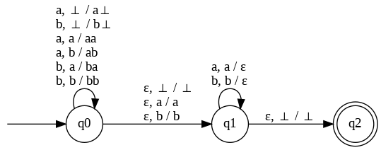
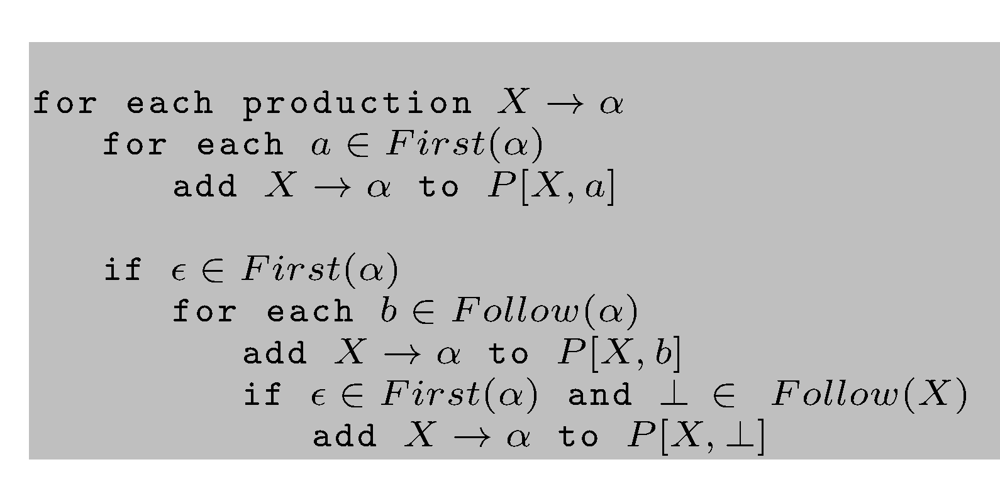
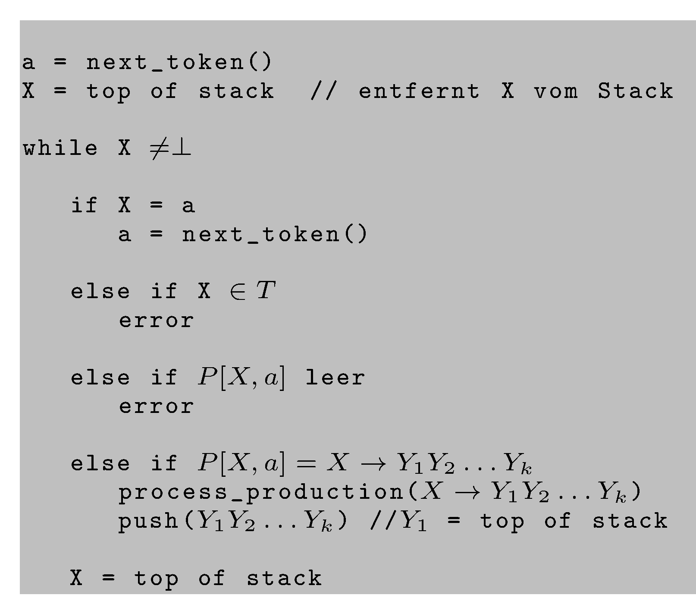

# CFG

> [!NOTE]
>
> 

>
> 
<strong>🖇 Weitere Unterlagen</strong>

>
> - [Annotierte Folien: CFG,
>   LL-Parser](https://raw.githubusercontent.com/Compiler-CampusMinden/AnnotatedSlides/master/frontend_parsing_cfg.ann.ba.pdf)
>
> 

## Wiederholung

### Endliche Automaten, reguläre Ausdrücke, reguläre Grammatiken, reguläre Sprachen

- Wie sind DFAs und NFAs definiert?
- Was sind reguläre Ausdrücke?
- Was sind formale und reguläre Grammatiken?
- In welchem Zusammenhang stehen all diese Begriffe?
- Wie werden DFAs und reguläre Ausdrücke im Compilerbau eingesetzt?

## Motivation

### Wofür reichen reguläre Sprachen nicht?

Für z. B. alle Sprachen, in deren Wörtern Zeichen über eine Konstante
hinaus gezählt werden müssen. Diese Sprachen lassen sich oft mit
Variablen im Exponenten beschreiben, die unendlich viele Werte annehmen
können.

- $`a^ib^{2*i}`$ ist nicht regulär
- $`a^ib^{2*i}`$ für $`0 \leq i \leq 3`$ ist regulär

<!-- -->

- Wo finden sich die oben genannten Variablen bei einem DFA wieder?
- Warum ist die erste Sprache oben nicht regulär, die zweite aber?

### Themen für heute

- PDAs: mächtiger als DFAs, NFAs
- kontextfreie Grammatiken und Sprachen: mächtiger als reguläre
  Grammatiken und Sprachen
- DPDAs und deterministisch kontextfreie Grammatiken: die Grundlage der
  Syntaxanalyse im Compilerbau
- Der Einsatz kontextfreier Grammatiken zur Syntaxanalyse mittels
  Top-Down-Techniken

### Einordnung: Erweiterung der Automatenklasse DFA, um komplexere Sprachen als die regulären akzeptieren zu können

Wir spendieren den DFAs einen möglichst einfachen, aber beliebig großen,
Speicher, um zählen und matchen zu können. Wir suchen dabei
konzeptionell die “kleinstmögliche” Erweiterung, die die akzeptierte
Sprachklasse gegenüber DFAs vergrößert.

- Der konzeptionell einfachste Speicher ist ein Stack. Wir haben keinen
  wahlfreien Zugriff auf die gespeicherten Werte.

- Es soll eine deterministische und eine indeterministische Variante der
  neuen Automatenklasse geben.

- In diesem Zusammenhang wird der Stack auch Keller genannt.

### Kellerautomaten (Push-Down-Automata, PDAs)

**Def.:** Ein Kellerautomat (PDA)
$`P = (Q,\ \Sigma,\ \Gamma,\  \delta,\ q_0,\ \perp,\ F)`$ ist ein
Septupel mit:

<picture><source media="(prefers-color-scheme: light)" srcset="images/Def_PDA_light.png"><source media="(prefers-color-scheme: dark)" srcset="images/Def_PDA_dark.png"></picture>

Definition
eines PDAs

Ein PDA ist per Definition nichtdeterministisch und kann spontane
Zustandsübergänge durchführen.

### Was kann man damit akzeptieren?

Strukturen mit paarweise zu matchenden Symbolen.

Bei jedem Zustandsübergang wird ein Zeichen (oder $`\epsilon`$) aus der
Eingabe gelesen, ein Symbol von Keller genommen. Diese und das
Eingabezeichen bestimmen den Folgezustand und eine Zeichenfolge, die auf
den Stack gepackt wird. Dabei wird ein Symbol, (z. B. eines, das später
mit einem Eingabesymbol zu matchen ist,) auf den Stack gepackt. Soll das
automatisch vom Stack genommene Symbol auf dem Stack bleiben, muss es
wieder gepusht werden.

### Beispiel

Ein PDA für
$`L=\lbrace ww^{R}\mid w\in \lbrace a,b\rbrace^{\ast}\rbrace`$:

<picture><source media="(prefers-color-scheme: light)" srcset="images/pda2_light.png"><source media="(prefers-color-scheme: dark)" srcset="images/pda2_dark.png"></picture>

### Deterministische PDAs

**Def.** Ein PDA $`P = (Q, \Sigma, \Gamma, \delta, q_0, \perp, F)`$ ist
*deterministisch* $`: \Leftrightarrow`$

- $`\delta(q, a, X)`$ hat höchstens ein Element für jedes
  $`q \in Q, a \in\Sigma`$ oder $`(a = \epsilon`$ und $`X \in \Gamma)`$.

- Wenn $`\delta (q, a, x)`$ nicht leer ist für ein $`a \in \Sigma`$,
  dann muss $`\delta (q, \epsilon, x)`$ leer sein.

Deterministische PDAs werden auch *DPDAs* genannt.

### Der kleine Unterschied

**Satz:** Die von DPDAs akzeptierten Sprachen sind eine echte Teilmenge
der von PDAs akzeptierten Sprachen.

Die regulären Sprachen sind eine echte Teilmenge der von DPDAs
akzeptierten Sprachen.

## Kontextfreie Grammatiken und Sprachen

### Kontextfreie Grammatiken

**Def.** Eine *kontextfreie (cf-)* Grammatik ist ein 4-Tupel
$`G = (N, T, P, S)`$ mit $`N, T, S`$ wie in (formalen) Grammatiken und
$`P`$ ist eine endliche Menge von Produktionen der Form:

$`X \rightarrow Y`$ mit $`X \in N, Y \in {(N \cup T)}^{\ast}`$.

$`\Rightarrow, \overset{\ast}{\Rightarrow}`$ sind definiert wie bei
regulären Sprachen. Bei cf-Grammatiken nennt man die Ableitungsbäume oft
*Parse trees*.

### Beispiel

$`S \rightarrow a \mid S\ +\  S\ |\  S \ast S`$

Ableitungsbäume für $`a + a \ast a`$:

Hier entsteht ein Tafelbild.

### Nicht jede kontextfreie Grammatik ist eindeutig

**Def.:** Gibt es in einer von einer kontextfreien Grammatik erzeugten
Sprache ein Wort, für das mehr als ein Ableitungsbaum existiert, so
heißt diese Grammatik *mehrdeutig*. Anderenfalls heißt sie *eindeutig*.

**Satz:** Es ist nicht entscheidbar, ob eine gegebene kontextfreie
Grammatik eindeutig ist.

**Satz:** Es gibt kontextfreie Sprachen, für die keine eindeutige
Grammatik existiert.

### Kontextfreie Grammatiken und PDAs

**Satz:** Die kontextfreien Sprachen und die Sprachen, die von PDAs
akzeptiert werden, sind dieselbe Sprachklasse.

**Satz:** Eine von einem DPDA akzeptierteSprache hat eine eindeutige
Grammatik.

Vorgehensweise im Compilerbau: Eine Grammatik für die gewünschte Sprache
definieren und schauen, ob sich daraus ein DPDA generieren lässt
(automatisch).

## Syntaxanalyse

### Was brauchen wir für die Syntaxanalyse von Programmen?

- einen Grammatiktypen, aus dem sich manuell oder automatisiert ein
  Programm zur deterministischen Syntaxanalyse (=Parser) erstellen lässt

- einen Algorithmus zum Parsen von Programmen mit Hilfe einer solchen
  Grammatik

### Syntax

Wir verstehen unter Syntax eine Menge von Regeln, die die Struktur von
Daten (z. B. Programmen) bestimmen.

Diese vorgegebene Syntax wird im Compilerbau mit einer kontextfreien
Grammatik beschrieben und mit einem sogenannten **Parser** analysiert.

Heute: LL-Parsing, mit dem man eine Teilmenge der eindeutigen
kontextfreien Grammatiken syntaktich analysieren kann.

Dabei wird der Ableitungsbaum von oben nach unten aufgebaut.

### Ziele der Syntaxanalyse

- Bestimmung der syntaktischen Struktur eines Programms

- aussagekräftige Fehlermeldungen, wenn ein Eingabeprogramm syntaktisch
  nicht korrekt ist

- Erstellung des AST (abstrakter Syntaxbaum): Der Parse Tree ohne
  Symbole, die nach der Syntaxanalyse inhaltlich irrelevant sind (z. B.
  Semikolons, manche Schlüsselwörter)

- die Symboltablelle(n) mit Informationen bzgl. Bezeichner (Variable,
  Funktionen und Methoden, Klassen, benutzerdefinierte Typen, Parameter,
  …), aber auch die Gültigkeitsbereiche.

## LL(k)-Grammatiken

### First-Mengen

$`S \rightarrow A \ \vert \ B \ \vert \ C`$

Welche Produktion nehmen?

Wir brauchen die “terminalen k-Anfänge” von Ableitungen von
Nichtterminalen, um eindeutig die nächste zu benutzende Produktion
festzulegen. $`k`$ ist dabei die Anzahl der Vorschautoken.

**Def.:** Wir definieren $`First`$ - Mengen einer Grammatik wie folgt:

- $`a \in T^\ast, |a| \leq k: {First}_k (a) = \lbrace a \rbrace`$
- $`a \in T^\ast, |a| > k: {First}_k (a) = \lbrace v \in T^\ast \mid a = vw, |v| = k \rbrace`$
- $`\alpha \in (N \cup T)^\ast \backslash T^\ast: {First}_k (\alpha) = \lbrace v \in T^\ast \mid  \alpha \overset{\ast}{\Rightarrow} w,\text{mit}\ w \in T^\ast, First_k(w) = \lbrace v \rbrace \rbrace`$

### Linksableitungen

**Def.:** Bei einer kontextfreien Grammatik $`G`$ ist die
*Linksableitung* von $`\alpha \in (N \cup T)^{\ast}`$ die Ableitung, die
man erhält, wenn in jedem Schritt das am weitesten links stehende
Nichtterminal in $`\alpha`$ abgeleitet wird.

Man schreibt $`\alpha \overset{\ast}{\Rightarrow}_l \beta.`$

### LL(k)-Grammatiken

**Def.:** Eine kontextfreie Grammatik $`G = (N, T, P, S)`$ ist genau
dann eine *LL(k)*-Grammatik, wenn für alle Linksableitungen der Form:

$`S \overset{\ast}{\Rightarrow}_l\ wA \gamma\ {\Rightarrow}_l\ w\alpha\gamma \overset{\ast}{\Rightarrow}_l wx`$

und

$`S \overset{\ast}{\Rightarrow}_l wA \gamma {\Rightarrow}_l w\beta\gamma \overset{\ast}{\Rightarrow}_l wy`$

mit
$`(w, x, y \in T^\ast, \alpha, \beta, \gamma \in (N \cup T)^\ast, A \in N)`$
und $`First_k(x) = First_k(y)`$ gilt:

$`\alpha = \beta`$

### LL(1)-Grammatiken

Hier entsteht ein Tafelbild.

### LL(k)-Sprachen

Die von *LL(k)*-Grammatiken erzeugten Sprachen sind eine echte Teilmenge
der deterministisch parsbaren Sprachen.

Die von *LL(k)*-Grammatiken erzeugten Sprachen sind eine echte Teilmenge
der von *LL(k+1)*-Grammatiken erzeugten Sprachen.

Für eine kontextfreie Grammatik $`G`$ ist nicht entscheidbar, ob es eine
*LL(1)* - Grammatik $`G'`$ gibt mit $`L(G) = L(G')`$.

In der Praxis reichen *LL(1)* - Grammatiken oft. Hier gibt es effiziente
Parsergeneratoren (hier: ANTLR), deren Eingabe eine LL-Grammatik ist,
und die als Ausgabe den Quellcode eines (effizienten)
tabellengesteuerten Parsers generieren.

### Was brauchen wir zur Erzeugung eines LL(k)-Parsers?

- eine *LL(k)*-Grammatik
- die $`First_k`$-Mengen der rechten Seiten aller Produktionsregeln
- die $`Follow_k`$-Mengen aller Nichtterminale und der rechten Seiten
  aller Produktionsregeln
- das Endezeichen $`\perp`$ hinter dem Eingabewort

**Def.:** Wir definieren $`Follow`$ - Mengen einer Grammatik wie folgt:

$`Follow_k(\beta) = \lbrace w \in T^\ast\ |\ \exists \alpha, \gamma \in (N \cup T)^\ast\ \text{mit}\ S \overset{\ast}{\Rightarrow}_l\ \alpha \beta \gamma\ \text{und}\ w \in First_k(\gamma) \rbrace`$

### Beispiel: First- und Follow-Mengen

Hier entsteht ein Tafelbild.

### Algorithmus: Konstruktion einer LL-Parsertabelle

**Eingabe:** Eine Grammatik $`G = (N, T, P, S)`$

**Ausgabe:** Eine Parsertabelle $`P`$

<picture><source media="(prefers-color-scheme: light)" srcset="images/LL-Parsertabelle_light.png"><source media="(prefers-color-scheme: dark)" srcset="images/LL-Parsertabelle_dark.png"></picture>

Algorithmus
zur Generierung einer LL-Parsertabelle

Statt $`First_1(\alpha)`$ wird oft nur $`First(\alpha)`$ geschrieben.

### Beispiel: LL-Parsertabellen

Hier entsteht ein Tafelbild.

### LL-Parser

Rekursive Programmierung bedeutet, dass das Laufzeitsystem einen Stack
benutzt. Diesen Stack kann man auch “selbst programmieren”, d. h. einen
PDA implementieren. Dabei wird ebenfalls die oben genannte Tabelle zur
Bestimmung der nächsten anzuwendenden Produktion benutzt. Der Stack
enthält die zu erwartenden Eingabezeichen, wenn immer eine
Linksableitung gebildet wird. Diese Zeichen im Stack werden mit dem
Input gematcht.

### Algorithmus: Tabellengesteuertes LL-Parsen mit einem PDA

**Eingabe:** Eine Grammatik $`G = (N, T, P, S)`$, eine Parsertabelle
$`P`$ mit “$`w\perp`$” als initialem Kellerinhalt

**Ausgabe:** Wenn $`w \in L(G)`$, eine Linksableitung von $`w`$, Fehler
sonst

<picture><source media="(prefers-color-scheme: light)" srcset="images/LL-Parser_light.png"><source media="(prefers-color-scheme: dark)" srcset="images/LL-Parser_dark.png"></picture>

Algorithmus
zum tabellengesteuerten LL-Parsen

### Beispiel: LL-Parsen

Hier entsteht ein Tafelbild.

### Ergebnisse der Syntaxanalyse

- eventuelle Syntaxfehler mit Angabe der Fehlerart und des -Ortes

- Format für die Weiterverarbeitung:

  - Ableitungsbaum oder Syntaxbaum oder Parse Tree
  - abstrakter Syntaxbaum (AST): Der Parse Tree ohne Symbole, die nach
    der Syntaxanalyse inhaltlich irrelevant sind (z. B. ;, Klammern,
    manche Schlüsselwörter, $`\ldots`$)

## Wrap-Up

### Das sollen Sie mitnehmen

- Die Struktur von gängigen Programmiersprachen lässt sich nicht mit
  regulären Ausdrücken beschreiben und damit nicht mit DFAs akzeptieren.
- Das Automatenmodell der DFAs wird um einen endlosen Stack erweitert,
  das ergibt PDAs.
- Kontextfreie Grammatiken (CFGs) erweitern die regulären Grammatiken.
- Deterministisch parsebare Sprachen haben eine eindeutige kontextfreie
  Grammatik.
- Es ist nicht entscheidbar, ob eine gegebene kontextfreie Grammatik
  eindeutig ist.
- Syntaxanalyse wird mit deterministisch kontextfreien Grammatiken
  durchgeführt.
- Eine Teilmenge der dazu gehörigen Sprachen lässt sich top-down parsen.
- Ein effizienter LL(k)-Parser realisiert einen DPDA und kann
  automatisch aus einer LL(k)-Grammatik generiert werden.
- Der Parser liefert in der Regel einen abstrakten Syntaxbaum.

## 📖 Zum Nachlesen

- Aho u. a. ([2023](#ref-Aho2023))
- Hopcroft u. a. ([2003](#ref-hopcroft2003))

> [!NOTE]
>
> 

>
> 
<strong>✅ Lernziele</strong>

>
> - k1: PDAs
> - k1: Deterministische PDAs
> - k1: Kontextfreie Grammatiken
> - k1: Deterministisch kontextfreie Grammatiken
> - k1: Top-Down-Analyse
> - k1: LL-Parser
> - k2: Zusammenhang zwischen PDAs und kontextfreien Grammatiken
>
> 

------------------------------------------------------------------------

> [!NOTE]
>
> 

>
> 
<strong>👀 Quellen</strong>

>
> 

>
> 

>
> Aho, A. V., M. S. Lam, R. Sethi, J. D. Ullman, und S. Bansal. 2023.
> *Compilers: Principles, Techniques, and Tools, Updated 2nd Edition by
> Pearson*. Pearson India.
> <https://learning.oreilly.com/library/view/compilers-principles-techniques/9789357054881/>.
>
> 

>
> 

>
> Hopcroft, J. E., R. Motwani, und J. D. Ullman. 2003. *Einführung in
> die Automatentheorie, formale Sprachen und Komplexitätstheorie*. I
> theoretische informatik. Pearson Education Deutschland GmbH.
>
> 

>
> 

>
> 

------------------------------------------------------------------------

Unless otherwise noted, this work is licensed under CC BY-SA 4.0.

<blockquote>
<strong>Last modified:</strong> f7ac9d2 (reformat using shorter lines, 2025-08-09) 
</blockquote>
