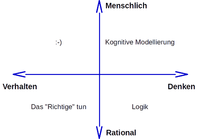
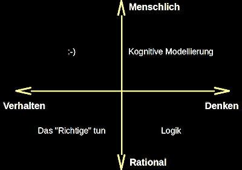
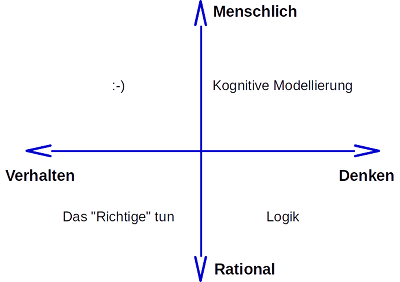

# Test Markdown

> [!IMPORTANT]
>
> <details open>
>
> <summary><strong>🎯 TL;DR</strong></summary>
>
> Text für TL;DR …
>
> In Parr ([2014](#ref-Parr2014)) wird geschrieben, blablablabla …
>
> Wir können hier sowohl Inline-Math ($`a^ib^{2*i}`$) als auch
> Block-Math:
>
> ``` math
> \Phi(\mathbf{g}_i) = F(\Gamma(\mathbf{g}_i)) - w\cdot\sum_j(Z_j(\Gamma(\mathbf{g}_i)))^2
> ```
>
> Code sollte auch gehen: `inline`, aber auch block:
>
>     fun fib(x) {
>         if (x == 0) {
>             return 0;
>         } else {
>             if (x == 1) {
>                 return 1;
>             } else {
>                 fib(x - 1) + fib(x - 2);
>             }
>         }
>     }
>
>     var wuppie = fib(4);
>
> Lorem ipsum dolor sit amet, consectetur adipiscing elit. In eu
> vulputate nisl. Ut scelerisque magna eros, at semper lectus vulputate
> vitae. Nullam egestas tellus lorem, eget sodales mauris lacinia ut.
> Etiam a viverra ex. Nam eu nisl vel nisl cursus condimentum. Aliquam
> accumsan augue ut consequat viverra. Curabitur sagittis est mauris, at
> molestie arcu condimentum ut. Quisque efficitur porta maximus. Donec
> non leo est. Aenean interdum condimentum libero, ac cursus dolor
> condimentum in. Nullam lorem ex, iaculis a orci vitae, iaculis aliquam
> enim.
>
> Quisque est lacus, pellentesque vitae fringilla vitae, bibendum sit
> amet dolor. Proin rutrum metus sit amet hendrerit lobortis. Fusce ut
> ultrices enim. Morbi a urna rutrum, fringilla augue mattis, mollis
> lacus. Pellentesque elementum vitae magna ac feugiat. Vestibulum et
> metus eget augue finibus fringilla ac at velit. Cras eleifend in nisl
> ac commodo. Orci varius natoque penatibus et magnis dis parturient
> montes, nascetur ridiculus mus. Suspendisse id mi nec diam
> pellentesque varius. Morbi in consequat neque, at bibendum purus.
> Quisque a est bibendum, pellentesque quam ac, fermentum diam. Cras
> augue nibh, tincidunt eu mollis at, hendrerit nec ex. Integer
> condimentum neque velit, eget aliquam justo iaculis ac.
>
> Nam consequat vehicula faucibus. In consequat sed lacus sed congue. Ut
> quis risus vel erat tincidunt molestie. Nullam nibh lorem, placerat et
> dignissim porttitor, mollis eget nisl. Mauris eu justo nisi. Sed
> viverra, enim in tincidunt blandit, dui eros mattis nulla, in
> elementum neque ex sed diam. Aliquam nec neque vitae sapien pulvinar
> tempus. Donec gravida interdum nunc sed feugiat. Curabitur finibus sed
> urna at rutrum. Maecenas mollis pulvinar lobortis. Mauris dignissim
> orci ut metus eleifend, eget porttitor purus rhoncus. Phasellus
> volutpat egestas odio mollis pharetra. Cras sem dolor, commodo eu
> lectus vel, ultrices fringilla tellus. Fusce eleifend orci sed
> porttitor imperdiet. Phasellus suscipit, est ut semper blandit, ligula
> dui scelerisque felis, varius tincidunt tellus est vitae lectus.
> Phasellus eu molestie urna.
>
> Sed sed leo vestibulum, iaculis justo in, aliquet mauris. Nunc luctus,
> metus quis vulputate lobortis, libero lacus imperdiet turpis, sit amet
> hendrerit magna nisi at leo. Pellentesque vehicula, mauris nec varius
> tempus, odio diam hendrerit mi, id porttitor ex felis ut sem. Vivamus
> tellus lacus, vehicula a augue non, aliquet aliquam quam. Donec
> dapibus quam sed ante blandit, in imperdiet enim dapibus. Etiam
> imperdiet sapien nec quam lobortis aliquet. Nam est eros, luctus
> consequat nulla ac, dapibus efficitur augue. Morbi tempor ex sed
> consectetur pharetra. Morbi ullamcorper ac enim nec accumsan. Nulla
> vestibulum eu turpis et rutrum.
>
> Donec laoreet lectus at laoreet condimentum. Nulla porttitor elit
> iaculis turpis vestibulum, eget lobortis dolor pretium. Nulla
> sollicitudin convallis ultrices. Integer porttitor a nunc a viverra.
> Vestibulum pulvinar a urna et posuere. Duis sem nibh, consequat vitae
> ornare id, porttitor vel odio. Duis sit amet mi non odio accumsan
> condimentum sit amet non leo. Duis ut ligula ligula.
>
> Phasellus sagittis non nisi eu ultricies. Donec quis ipsum at velit
> finibus mollis. Praesent facilisis blandit ligula. Pellentesque nec
> quam id neque lobortis egestas. Etiam nec risus feugiat, pulvinar mi
> in, vestibulum justo. Proin ac nisi scelerisque, bibendum tellus quis,
> lacinia leo. Vestibulum consequat fermentum est, eget cursus est
> efficitur ut. Fusce quis bibendum sapien. Vivamus vel nisl nulla. Nunc
> vehicula, odio ac ultricies iaculis, turpis turpis mollis dolor, et
> lobortis tortor ligula vel nisl. Nullam eget mi rutrum, suscipit felis
> at, dignissim justo. Praesent dapibus, arcu at luctus hendrerit, neque
> odio rhoncus lectus, vel semper lectus orci et ex. Etiam gravida, ex
> id hendrerit elementum, dolor urna lobortis quam, id commodo est erat
> eu purus. Nullam vitae diam id dui luctus imperdiet et eget est. Nam
> tincidunt elit nisl, id varius purus condimentum ut.
>
> Nullam pharetra metus eu felis elementum suscipit. Quisque ultricies
> ultrices tellus, vitae volutpat diam suscipit vitae. Phasellus vel
> ornare erat, ut malesuada neque. Suspendisse ac justo sit amet urna
> tincidunt efficitur a sit amet nisi. Vivamus varius dolor lacinia,
> sodales dolor id, molestie diam. Duis mi eros, vestibulum sed odio
> quis, maximus ultricies nunc. Cras dapibus scelerisque arcu at
> consequat. Maecenas mattis mauris id luctus ultrices.
>
> In mollis, ligula ac dignissim porttitor, enim erat vulputate leo, in
> interdum sapien lorem vitae metus. Sed condimentum id massa quis
> venenatis. Nam vitae lobortis libero, sed porttitor mauris. Morbi
> volutpat quis metus sit amet egestas. In in tortor non justo luctus
> pretium. Quisque rutrum neque lacus, sit amet hendrerit erat dignissim
> eu. Aenean justo dui, suscipit in mauris quis, mattis fringilla
> ligula. Fusce ac nibh dictum, iaculis augue id, sollicitudin mi.
> Pellentesque commodo, orci ac commodo congue, libero nunc hendrerit
> est, a maximus metus sem sed arcu. Maecenas venenatis sodales purus,
> eu interdum nunc dignissim nec. Cras aliquam ligula a sollicitudin
> hendrerit.
>
> Suspendisse fringilla pretium risus, quis pharetra lacus laoreet quis.
> Nulla ultrices eros odio, id tincidunt lacus lobortis sed. In suscipit
> lacus vel risus cursus commodo vel nec nulla. Sed a sapien fringilla,
> commodo mi quis, luctus erat. Nam suscipit quam et nisl dictum, ut
> condimentum tortor tempor. Vestibulum ante ipsum primis in faucibus
> orci luctus et ultrices posuere cubilia curae; Suspendisse cursus,
> lacus sed sodales tincidunt, tellus ex blandit libero, quis tincidunt
> lectus leo eget magna. Donec sodales sodales ex vel sodales.
> Vestibulum pellentesque tellus vitae mauris gravida blandit.
> Pellentesque dignissim sem id lacus vulputate, sit amet laoreet ex
> tempor.
>
> Morbi dictum dapibus diam in vulputate. Nam sed magna fringilla,
> congue purus in, tincidunt ante. Vestibulum quis ultricies neque. Cras
> nec dui id augue laoreet tempus at sit amet sem. Quisque mauris sem,
> ullamcorper a scelerisque sit amet, rhoncus nec risus. Donec
> malesuada, mauris a bibendum gravida, erat lectus ornare metus, quis
> iaculis erat tellus in turpis. Suspendisse nulla enim, mattis id
> fringilla sed, venenatis scelerisque lorem. Integer eget ex velit.
> Duis blandit risus mauris, eget iaculis velit eleifend a. Fusce
> volutpat justo sit amet tempus vulputate. Vivamus ac leo tempor,
> dapibus justo aliquam, mollis mi. Aenean pellentesque ipsum at quam
> dictum rutrum. Aliquam maximus commodo augue, ac egestas elit lobortis
> quis. Morbi vel ex ac sapien tincidunt aliquet. Donec pharetra ac
> felis non placerat. Integer fermentum vel velit sed auctor.
> </details>

> [!TIP]
>
> <details open>
>
> <summary><strong>🎦 Videos</strong></summary>
>
> - [VL Parser mit ANTLR (YouTube)](https://youtu.be/YuUHBvPUS4k)
> - [Demo ANTLR Parser (YouTube)](https://youtu.be/FJOEPY-TMmw)
> - <https://foo.bar.de>
> - [VL Git Basics (HSBI
>   Medienportal)](https://www.hsbi.de/medienportal/m/3a44c8a32e7699db77ae922c6b8944acf0d8c65b78d02859e707ffdf783ea45a78200312cdb8102c1052f382101b69a5092bcaf0a11ded36b98f4552a4aca345)
>
> </details>

> [!NOTE]
>
> <details open>
>
> <summary><strong>🖇 Weitere Unterlagen</strong></summary>
>
> - [Folien (raw
>   link)](https://raw.githubusercontent.com/Artificial-Intelligence-HSBI-TDU/KI-Vorlesung/master/lecture/nn/files/NN03-Logistische_Regression.pdf)
> - [Folien](https://github.com/cagix/test-pandoc-lecture/blob/_pdf/lecture_03-test_test.pdf)
>
> </details>

<p align="center">

[**GH-Preview**](https://github.com/cagix/test-pandoc-lecture/blob/_gfm/readme.md)

</p>

## Hello World

Hier ist normaler Markdown-Text, mit **fett** und auch *kursiv*.

- Stichpunkt 1
- Stichpunkt 2
- Stichpunkt 3

1.  Aufzählung 1
2.  Aufzählung 2
3.  Aufzählung 3
    1.  Unterpunkt 3.1
    2.  Unterpunkt 3.2

Hier die <span class="mark">Pandoc-Markdown</span> mark-Erweiterung.

## Math

### Inline

$`\mathbf{g} = (g_1, \dots, g_m)\in \{ 0,1\}^m`$

- $`a^ib^{2*i}`$ ist nicht regulär
- $`a^ib^{2*i}`$ für $`0 \leq i \leq 3`$ ist regulär

### Block

``` math
\Phi(\mathbf{g}_i) = F(\Gamma(\mathbf{g}_i)) - w\cdot\sum_j(Z_j(\Gamma(\mathbf{g}_i)))^2
```

``` math
p_{sel}(\mathbf{g}_k) = \frac{\Phi(\mathbf{g}_k)}{\sum_j \Phi(\mathbf{g}_j)}
```

``` math
g_i^{(t+1)} = \left\{
\begin{array}{ll}
    \neg g_i^{(t)} & \mbox{ falls } \chi_i \le p_{mut}\\[5pt]
    \phantom{\neg} g_i^{(t)} & \mbox{ sonst }
\end{array}
\right.
```

------------------------------------------------------------------------

### Known Problems

- VSCode Preview: `\mbox{ tanh }` =\> $`\mbox{ tanh }`$ =\>
  `\text{ tanh }` =\> $`\text{ tanh }`$
- GH Preview:
  - `\phantom{xyz}` =\> $`\phantom{xyz}`$ =\> ?? =\> ??
  - `\operatorname{tanh}` =\> $`\operatorname{tanh}`$ =\>
    `\mathop{\text{tanh}}` =\> $`\mathop{\text{tanh}}`$

``` math
g_i^{(t+1)} = \left\{
\begin{array}{rll}
    \neg & g_i^{(t)} & \text{ falls } \chi_i \le p_{mut}\\[5pt]
    & g_i^{(t)} & \text{ sonst }
\end{array}
\right.
```

<span class="mark">Schwierig</span>: In Pandoc-Markdown muss Mathe mit
`$` oder `$$` eingeschlossen werden, unabhängig vom konkreten Inhalt. In
LaTeX ist aber `\begin{eqnarray}` bereits der Beginn einer
Mathe-Umgebung, d.h. hier wären extra `$$`
<span class="mark">falsch</span>. Das muss per Filter korrigiert werden!

    $$\begin{eqnarray}
    S &\rightarrow& a A                      \nonumber \\
    A &\rightarrow& d B \ | \ b A \ | \ c A  \nonumber \\
    B &\rightarrow& a c \ | \ b C \ | \ c A  \nonumber \\
    C &\rightarrow& \epsilon                 \nonumber
    \end{eqnarray}$$

should become

``` math
\begin{eqnarray}
S &\rightarrow& a A                      \nonumber \\
A &\rightarrow& d B \ | \ b A \ | \ c A  \nonumber \\
B &\rightarrow& a c \ | \ b C \ | \ c A  \nonumber \\
C &\rightarrow& \epsilon                 \nonumber
\end{eqnarray}
```

### Tests

#### Inline Math

`array` as inline math:

$`\begin{array}{rll}
    \neg & g_i^{(t)} & \text{ falls } \chi_i \le p_{mut}\\[5pt]
    & g_i^{(t)} & \text{ sonst }
\end{array}`$

`eqnarray` as inline math:

$`\begin{eqnarray}
S &\rightarrow& a A                      \nonumber \\
A &\rightarrow& d B \ | \ b A \ | \ c A  \nonumber \\
B &\rightarrow& a c \ | \ b C \ | \ c A  \nonumber \\
C &\rightarrow& \epsilon                 \nonumber
\end{eqnarray}`$

#### Block Math

`array` as block math:

``` math
\begin{array}{rll}
    \neg & g_i^{(t)} & \text{ falls } \chi_i \le p_{mut}\\[5pt]
    & g_i^{(t)} & \text{ sonst }
\end{array}
```

`eqnarray` as block math:

``` math
\begin{eqnarray}
S &\rightarrow& a A                      \nonumber \\
A &\rightarrow& d B \ | \ b A \ | \ c A  \nonumber \\
B &\rightarrow& a c \ | \ b C \ | \ c A  \nonumber \\
C &\rightarrow& \epsilon                 \nonumber
\end{eqnarray}
```

#### Newline after `$$`

`array` as block math w/ newline:

``` math
  \begin{array}{rll}
    \neg & g_i^{(t)} & \text{ falls } \chi_i \le p_{mut}\\[5pt]
    & g_i^{(t)} & \text{ sonst }
  \end{array}
```

`eqnarray` as block math w/ newline:

``` math
\begin{eqnarray}
S &\rightarrow& a A                      \nonumber \\
A &\rightarrow& d B \ | \ b A \ | \ c A  \nonumber \\
B &\rightarrow& a c \ | \ b C \ | \ c A  \nonumber \\
C &\rightarrow& \epsilon                 \nonumber
\end{eqnarray}
```

## Links

### Link to WWW

[craftinginterpreters.com/the-lox-language.html](https://www.craftinginterpreters.com/the-lox-language.html)

### Internal Links

[selbe ebene: readme.md](readme.md)

[unterordner: subfolder/foo.md](subfolder/foo.md)

[zurück nach oben I:
../02-parsing/antlr-parsing.md](../02-parsing/antlr-parsing.md)

[zurück nach oben II:
../../homework/sheet01.md](../../homework/sheet01.md)

## Code

``` antlr
grammar Hello;

start : stmt* ;

stmt  : ID '=' expr ';' | expr ';' ;
expr  : term ('+' term)* ;
term  : atom ('*' atom)* ;
atom  : ID | NUM ;

ID    : [a-z][a-zA-Z]* ;
NUM   : [0-9]+ ;
WS    : [ \t\n]+ -> skip ;
```

------------------------------------------------------------------------

Java-Code kompilieren: `javac *.java`

``` java
import org.antlr.v4.runtime.CharStreams;
import org.antlr.v4.runtime.CommonTokenStream;
import org.antlr.v4.runtime.tree.ParseTree;

public class Main {
    public static void main(String[] args) throws Exception {
        HelloLexer lexer = new HelloLexer(CharStreams.fromStream(System.in));
        CommonTokenStream tokens = new CommonTokenStream(lexer);
        HelloParser parser = new HelloParser(tokens);

        ParseTree tree = parser.start();  // Start-Regel
        System.out.println(tree.toStringTree(parser));
    }
}
```

------------------------------------------------------------------------

Code ohne alles

    import org.antlr.v4.runtime.CharStreams;
    import org.antlr.v4.runtime.CommonTokenStream;
    import org.antlr.v4.runtime.tree.ParseTree;

    public class Main {
        public static void main(String[] args) throws Exception {
            HelloLexer lexer = new HelloLexer(CharStreams.fromStream(System.in));
            CommonTokenStream tokens = new CommonTokenStream(lexer);
            HelloParser parser = new HelloParser(tokens);

            ParseTree tree = parser.start();  // Start-Regel
            System.out.println(tree.toStringTree(parser));
        }
    }

## Images

Figures (w/ caption) should be centered like in LaTeX. Inline images
will appear as is (also like in LaTeX).

### Images with Caption

kleines Bild, keine Breiteangabe:

<p align="center"><picture><source media="(prefers-color-scheme: light)" srcset="img/b_light.png"><source media="(prefers-color-scheme: dark)" srcset="img/b_dark.png"></picture></p><p align="center">“B”
(small)</p>

------------------------------------------------------------------------

kleines Bild, mit Titel und Breite:

<p align="center"><picture><source media="(prefers-color-scheme: light)" srcset="img/b_light.png"><source media="(prefers-color-scheme: dark)" srcset="img/b_dark.png"></picture></p><p align="center">“B”,
width=“5%”</p>

------------------------------------------------------------------------

breites Bild, keine Breiteangabe:

<p align="center"><picture><source media="(prefers-color-scheme: light)" srcset="img/wuppie_light.png"><source media="(prefers-color-scheme: dark)" srcset="img/wuppie_dark.png"></picture></p><p align="center">“wuppie”
(wide)</p>

------------------------------------------------------------------------

breites Bild, mit Breiteangabe:

<p align="center"><picture><source media="(prefers-color-scheme: light)" srcset="img/wuppie_light.png"><source media="(prefers-color-scheme: dark)" srcset="img/wuppie_dark.png"></picture></p><p align="center">“wuppie”,
width=“20%”</p>

------------------------------------------------------------------------

breites Bild über HTTP, keine Breiteangabe:

<p align="center"></p><p align="center">“wuppie”
via web (raw)</p>

------------------------------------------------------------------------

breites Bild über HTTP mit `credits`-Span, keine Breiteangabe:

<p align="center"></p><p align="center">“wuppie”
via web (raw) (Quelle: “FooFOOOO” by me on void.intern.com)</p>

Quelle: “Foo” by me on void.extern.com

### Images w/o Caption

ohne alles:

<picture><source media="(prefers-color-scheme: light)" srcset="img/b_light.png"><source media="(prefers-color-scheme: dark)" srcset="img/b_dark.png"></picture>

------------------------------------------------------------------------

mit breitenangabe:

<picture><source media="(prefers-color-scheme: light)" srcset="img/b_light.png"><source media="(prefers-color-scheme: dark)" srcset="img/b_dark.png"></picture>

------------------------------------------------------------------------

mit breitenangabe (“width”) und titel:

<picture><source media="(prefers-color-scheme: light)" srcset="img/b_light.png"><source media="(prefers-color-scheme: dark)" srcset="img/b_dark.png"></picture>

------------------------------------------------------------------------

mit breitenangabe (“web_width”) und titel:

<picture><source media="(prefers-color-scheme: light)" srcset="img/b_light.png"><source media="(prefers-color-scheme: dark)" srcset="img/b_dark.png"></picture>

------------------------------------------------------------------------

mit breitenangabe (“width” und “web_width”) und titel:

<picture><source media="(prefers-color-scheme: light)" srcset="img/b_light.png"><source media="(prefers-color-scheme: dark)" srcset="img/b_dark.png"></picture>

### Images w/ `img`-Code

using “5%”:


using “80px”:


mit div drumherum:

<div style="width: 5%;">

<picture><source media="(prefers-color-scheme: light)" srcset="img/b_light.png"><source media="(prefers-color-scheme: dark)" srcset="img/b_dark.png"></picture>

</div>

### Known Problems

- In VSC preview as well as in LaTeX images via web like
  https://github.com/cagix/pandoc-thesis/blob/master/figs/wuppie.png do
  not work (**need to be “raw”**)

------------------------------------------------------------------------

### Images from Web (LaTeX backend)

When converting to LaTeX (PDF, Beamer), Pandoc will attempt to download
the referred images. However, recently a lot of sites deny this. It
seems we need to set an user-agent.


Quelle: [Turing Test version
3.png](https://commons.wikimedia.org/wiki/File:Turing_Test_version_3.png)
by [Bilby](https://commons.wikimedia.org/wiki/User:Bilby) on Wikimedia
Commons ([Public
Domain](https://en.wikipedia.org/wiki/en:public_domain))

The conversion above will fail with

    Could not convert image /tmp/tex2pdf.-c72add2811a5b622/3d299b2a35aa76ba2acfef6d4887a64d6ea8e601.txt: Cannot load file
      Jpeg Invalid marker used
      PNG Invalid PNG file, signature broken
      Bitmap Invalid Bitmap magic identifier
      GIF Invalid Gif signature : Please
      HDR Invalid radiance file signature
      Tiff Invalid endian tag value
      TGA not enough bytes
    Error producing PDF.
    ! LaTeX Error: Unknown graphics extension: .txt.

    See the LaTeX manual or LaTeX Companion for explanation.
    Type  H <return>  for immediate help.
     ...

    l.1089 ...b2a35aa76ba2acfef6d4887a64d6ea8e601.txt}

unless there is a user-agent defined like

``` yaml
request-headers:
  - ["User-Agent", "Mozilla/5.0"]
```

**Note**: This is only needed, when Pandoc attempts to download the
image locally, i.e. when converting to LaTeX based formats like PDF or
Beamer. No need to set this for web based formats like GFM or Markdown
since we just leave the link as it is.

(see https://github.com/cagix/pandoc-lecture-zen/issues/57) (see
https://github.com/Artificial-Intelligence-HSBI-TDU/KI-Vorlesung/issues/455)

## Tabellen

mit caption:

| Rechtsbündig | Linksbündig | Default | Zentriert |
|-------------:|:------------|---------|:---------:|
|          foo | foo         | foo     |    foo    |
|          123 | 123         | 123     |    123    |
|          bar | bar         | bar     |    bar    |

Tabelle als Markdown-Pipe-Table, vgl. ([Abelson u. a. 1996](#ref-SICP))

------------------------------------------------------------------------

ohne caption:

| Rechtsbündig | Linksbündig | Default | Zentriert |
|-------------:|:------------|---------|:---------:|
|          foo | foo         | foo     |    foo    |
|          123 | 123         | 123     |    123    |
|          bar | bar         | bar     |    bar    |

## Zitieren, Quellen

Normales Zitieren ([Siek 2023](#ref-Siek2023racket)) …

Mit Seitenangabe ([Siek 2023, 111](#ref-Siek2023racket)) oder Kapitel
([Siek 2023, Kap. 111](#ref-Siek2023racket)) …

Als Author-Zitat Siek ([2023](#ref-Siek2023racket)) …

## GFM

### Darkmode vs. Lightmode

Diese Abbildung liegt in drei Varianten im Repo vor: transparenter
Hintergrund, light, dark. Die Einbindung ist auf “transparent”. Scale
ist auf 60%. Die Abbildung sollte sich automatisch umstellen.

<picture><source media="(prefers-color-scheme: light)" srcset="img/dimensionen-ki_light.png"><source media="(prefers-color-scheme: dark)" srcset="img/dimensionen-ki_dark.png"></picture>

<p align="center"><picture><source media="(prefers-color-scheme: light)" srcset="img/dimensionen-ki_light.png"><source media="(prefers-color-scheme: dark)" srcset="img/dimensionen-ki_dark.png"></picture></p><p align="center">Hier
könnte ihre Werbung stehen.</p>

Nachfolgend die “light”-Variante direkt:



Nachfolgend die “dark”-Variante direkt:



Nachfolgend eine Abbildung, die es nicht in light/dark im Repo gibt. Wie
verhält sich die Preview, so lange nicht beim Übersetzen die light- und
dark-Varianten mit generiert werden?

<picture><source media="(prefers-color-scheme: light)" srcset="img/test_transparentbackground_light.png"><source media="(prefers-color-scheme: dark)" srcset="img/test_transparentbackground_dark.png"></picture>

Und noch einmal, diesmal mit Caption.

<p align="center"><picture><source media="(prefers-color-scheme: light)" srcset="img/test_transparentbackground_light.png"><source media="(prefers-color-scheme: dark)" srcset="img/test_transparentbackground_dark.png"></picture></p><p align="center">Hier
könnte ihre Werbung stehen.</p>

### Details

<details>

<summary>

Zusammenfassung: NIX :)
</summary>

Lalelu …

</details>

### Alert Extension

GH introduced “alerts” with distinctive styling, like

> \[!NOTE\] Foo bar, wuppie fluppie!

> \[!TIP\] Foo bar, wuppie fluppie!

> \[!IMPORTANT\] Foo bar, wuppie fluppie!

> \[!WARNING\] Foo bar, wuppie fluppie!

> \[!CAUTION\] Foo bar, wuppie fluppie!

(see
https://github.blog/changelog/2023-12-14-new-markdown-extension-alerts-provide-distinctive-styling-for-significant-content/)

------------------------------------------------------------------------

Let’s stick with Pandocs divs in Markdown content and use filters for
export:

> [!NOTE]
>
> Foo bar, wuppie fluppie! Blablabla third line of nonsense …

> [!TIP]
>
> Foo bar, wuppie fluppie!

> [!IMPORTANT]
>
> Foo bar, wuppie fluppie!

> [!WARNING]
>
> Foo bar, wuppie fluppie!

> [!CAUTION]
>
> Foo bar, wuppie fluppie!

- Export to GH Markdown using [“distinctive
  alerts”](https://docs.github.com/en/get-started/writing-on-github/getting-started-with-writing-and-formatting-on-github/basic-writing-and-formatting-syntax#alerts)
- Export to Hugo using [notice
  shortcode](https://mcshelby.github.io/hugo-theme-relearn/shortcodes/notice/index.html)
- Export to Beamer using
  [beamercolorbox](https://tex.stackexchange.com/questions/411069/creating-beamer-box-environment)
  (also
  [beameruserguide.pdf](https://tug.ctan.org/macros/latex/contrib/beamer/doc/beameruserguide.pdf);
  or `block`, `alertblock`, `examples` -
  cf. https://www.overleaf.com/learn/latex/Beamer%23Creating_a_table_of_contents)

This should probably be in line with \#180 …

### GH Shenanigans

The GitHub Markdown parser has a really weird bug: as soon as there’s
inline math in a bullet point, any display math after that won’t render
properly in the whole bullet list.

#### Example

- Bullet point 1

- Bullet point 2 with block math (w/o blank line)

``` math
h(\mathbf{x}) = \mathbf{w}^T\mathbf{x} = w_0 + w_1x_1 + w_2x_2 + \ldots + w_nx_n
```

- Bullet point 3 with block math and blank line

``` math
\mathcal{L} = (\hat{y} - y)^2 = (h(\mathbf{x}) - y)^2
```

- Bullet point 4 with inline math ($`x_i`$) and block math and blank
  line

``` math
\mathcal{L} = (\hat{y} - y)^2 = (h(\mathbf{x}) - y)^2
```

- Bullet point 5 with image

  <picture><source media="(prefers-color-scheme: light)" srcset="img/b_light.png"><source media="(prefers-color-scheme: dark)" srcset="img/b_dark.png"></picture>

- Bullet point 6 with figure

  <p align="center"><picture><source media="(prefers-color-scheme: light)" srcset="img/b_light.png"><source media="(prefers-color-scheme: dark)" srcset="img/b_dark.png"></picture></p><p align="center">image
  caption</p>

- Bullet point 7 with code block

  ``` antlr
  grammar Hello;

  start : stmt* ;

  stmt  : ID '=' expr ';' | expr ';' ;
  expr  : term ('+' term)* ;
  term  : atom ('*' atom)* ;
  atom  : ID | NUM ;

  ID    : [a-z][a-zA-Z]* ;
  NUM   : [0-9]+ ;
  WS    : [ \t\n]+ -> skip ;
  ```

  foo bar wuppie fluppie - text below code block in bullet point 6

- simple bullet point

#### Tests

Using `bulletlist_displaymath.lua` to remove display math from bullet
points.

This filter is intended as a quick-and-dirty workaround. If a display
math element occurs in a bullet point, it is removed from the bullet
point. The bullet list obtained so far is terminated, the display math
element is inserted at the same AST level as the bullet list, and a new
bullet list is started for the remaining bullet points.

For reasons that are not entirely clear, empty pandoc.Para elements are
sometimes inserted into the bullet points. These are immediately removed
again here in the filter.

Note: If a bullet point contains text followed by display math followed
by text, the resulting order after the filter is no longer correct:
First, the complete bullet point is emitted, followed by the display
math.

``` markdown
-   wuppie $x_i$ fluppie:
    $$h(\mathbf{x}) = \mathbf{w}^T\mathbf{x} = w_0 + w_1x_1 + w_2x_2 + \ldots + w_nx_n$$
-   foo bar

compare with

-   wuppie fluppie:
    $$h(\mathbf{x}) = \mathbf{w}^T\mathbf{x} = w_0 + w_1x_1 + w_2x_2 + \ldots + w_nx_n$$
-   foo bar

compare with

-   wuppie $x_i$ fluppie:

$$h(\mathbf{x}) = \mathbf{w}^T\mathbf{x} = w_0 + w_1x_1 + w_2x_2 + \ldots + w_nx_n$$

-   foo bar

compare with

-   wuppie $x_i$ fluppie:
    $h(\mathbf{x}) = \mathbf{w}^T\mathbf{x} = w_0 + w_1x_1 + w_2x_2 + \ldots + w_nx_n$
-   foo bar

compare with

*   wuppie $x_i$ fluppie $w_0$:
    *   bla bla bla

    *   blub $x$ blub blub

        $$h(\mathbf{x}) = \mathbf{w}^T\mathbf{x} = w_0 + w_1x_1 + w_2x_2 + \ldots + w_nx_n$$

    *   brabbel brabbel brabbel

    *   blafasel $y$

        $$h(\mathbf{x}) = \mathbf{w}^T\mathbf{x} = w_0 + w_1x_1 + w_2x_2 + \ldots + w_nx_n$$

        blubfasel $z$

*   foobar

compare with

1.  wuppie $x_i$ fluppie $w_0$:

    $$h(\mathbf{x}^1) = \mathbf{w}^T\mathbf{x} = w_0 + w_1x_1 + w_2x_2 + \ldots + w_nx_n$$

    *   bla bla bla

    *   blub $x$ blub blub

        $$h(\mathbf{x}^2) = \mathbf{w}^T\mathbf{x} = w_0 + w_1x_1 + w_2x_2 + \ldots + w_nx_n$$

    *   brabbel brabbel brabbel

    *   blafasel $y$

        $$h(\mathbf{x}^3) = \mathbf{w}^T\mathbf{x} = w_0 + w_1x_1 + w_2x_2 + \ldots + w_nx_n$$

        blubfasel $z$

2.  foobar
```

**will be rendered as**

- wuppie $`x_i`$ fluppie:

``` math
h(\mathbf{x}) = \mathbf{w}^T\mathbf{x} = w_0 + w_1x_1 + w_2x_2 + \ldots + w_nx_n
```

- foo bar

compare with

- wuppie fluppie:

``` math
h(\mathbf{x}) = \mathbf{w}^T\mathbf{x} = w_0 + w_1x_1 + w_2x_2 + \ldots + w_nx_n
```

- foo bar

compare with

- wuppie $`x_i`$ fluppie:

``` math
h(\mathbf{x}) = \mathbf{w}^T\mathbf{x} = w_0 + w_1x_1 + w_2x_2 + \ldots + w_nx_n
```

- foo bar

compare with

- wuppie $`x_i`$ fluppie:
  $`h(\mathbf{x}) = \mathbf{w}^T\mathbf{x} = w_0 + w_1x_1 + w_2x_2 + \ldots + w_nx_n`$
- foo bar

compare with

- wuppie $`x_i`$ fluppie $`w_0`$:
  - bla bla bla

  - blub $`x`$ blub blub

  <!-- -->

  - brabbel brabbel brabbel

  - blafasel $`y`$

    blubfasel $`z`$

``` math
h(\mathbf{x}) = \mathbf{w}^T\mathbf{x} = w_0 + w_1x_1 + w_2x_2 + \ldots + w_nx_n
```

``` math
h(\mathbf{x}) = \mathbf{w}^T\mathbf{x} = w_0 + w_1x_1 + w_2x_2 + \ldots + w_nx_n
```

- foobar

compare with

1.  wuppie $`x_i`$ fluppie $`w_0`$:

    - bla bla bla

    - blub $`x`$ blub blub

    <!-- -->

    - brabbel brabbel brabbel

    - blafasel $`y`$

      blubfasel $`z`$

``` math
h(\mathbf{x}^1) = \mathbf{w}^T\mathbf{x} = w_0 + w_1x_1 + w_2x_2 + \ldots + w_nx_n
```

``` math
h(\mathbf{x}^2) = \mathbf{w}^T\mathbf{x} = w_0 + w_1x_1 + w_2x_2 + \ldots + w_nx_n
```

``` math
h(\mathbf{x}^3) = \mathbf{w}^T\mathbf{x} = w_0 + w_1x_1 + w_2x_2 + \ldots + w_nx_n
```

1.  foobar

#### Test Case nn02-linear-regression.md

[nn02-linear-regression.md](nn02-linear-regression.md)

## Filter for Slides and Handouts

Foo bar, wuppie fluppie! (NOTES)

## Footnotes

Sometimes[^1] we need some[^2] footnotes.

### Test for Docsify

~~Docsify seems to recognize footnotes even in inline code:~~

| **Zeichenkette** | **Beschreibt**                                           |
|:-----------------|:---------------------------------------------------------|
| `^`              | Zeilenanfang                                             |
| `[abc]`          | “a” oder “b” oder “c”                                    |
| `[^abc]`         | alles außer “a”, “b” oder “c” (Negation)                 |
| `^abc`           | test                                                     |
| `[ ^abc]`        | test                                                     |
| `[ ^abc]`        | test                                                     |
| `[^ abc]`        | test                                                     |
| `[a-zA-Z]`       | alle Zeichen von “a” bis “z” und “A” bis “Z” (Range)     |
| `[a-z&&[def]]`   | “d”,“e” oder “f” (Schnitt)                               |
| `[a-z&&[^bc]]`   | “a” bis “z”, außer “b” und “c”: `[ad-z]` (Subtraktion)   |
| `[a-z&&[^m-p]]`  | “a” bis “z”, außer “m” bis “p”: `[a-lq-z]` (Subtraktion) |

``` java
^               // Zeilenanfang
[abc]           // "a" oder "b" oder "c"
[^abc]          // alles außer "a", "b" oder "c" (Negation)
^abc            // test
[ ^abc]         // test
[ ^abc]         // test
[^ abc]         // test
[a-zA-Z]        // alle Zeichen von "a" bis "z" und "A" bis "Z" (Range)
[a-z&&[def]]    // "d","e" oder "f" (Schnitt)
[a-z&&[^bc]]    // "a" bis "z", außer "b" und "c": `[ad-z]` (Subtraktion)
[a-z&&[^m-p]]   // "a" bis "z", außer "m" bis "p": `[a-lq-z]` (Subtraktion)
```

## Handling of TeX Shenanigans

**Zustand:**  
(Formale) Beschreibung eines Zustandes der Welt

**Aktion:**  
(Formale) Beschreibung einer durch Agenten ausführbaren Aktion

- Anwendbar auf bestimmte Zustände
- Überführt Welt in neuen Zustand (“Nachfolge-Zustand”)

LaTeX-Befehle wie `\bigskip` etc. sollten automatisch entfernt werden:

Hier nach den LaTeX-Befehlen.

**Geeignete Abstraktionen wählen für Zustände und Aktionen!**

## Pandoc Shenanigans

Pandoc sometimes transforms whitespace into UTF8 whitespace, which
results in pdftex yelling at me, when this appears in lstlistings.

Example:

``` markdown
cf. https://www.overleaf.com/learn/latex/Beamer%23Creating_a_table_of_contents
```

normal white space:
cf. https://www.overleaf.com/learn/latex/Beamer%23Creating_a_table_of_contents

pandoc replacement:
cf. https://www.overleaf.com/learn/latex/Beamer%23Creating_a_table_of_contents

Also … hmmm. And “wuppie”?

## Columns

blablabla

Zum Parsen von Ausdrücken (*Expressions*) könnte man diese einfache
Grammatik einsetzen. Ein Ausdruck ist dabei entweder ein einfacher
Integer oder eine Addition oder Multiplikation zweier Ausdrücke.

``` yacc
expr : e1=expr '*' e2=expr      # MUL
     | e1=expr '+' e2=expr      # ADD
     | INT                      # NUM
     ;
```

Beim Parsen von “5\*4+3” würde dabei der folgende Parsetree entstehen:

<picture><source media="(prefers-color-scheme: light)" srcset="img/b_light.png"><source media="(prefers-color-scheme: dark)" srcset="img/b_dark.png"></picture>

wuppie! fluppie! foo? bar …

## Credits

Typische Regeln und Konventionen tauchen überall auf, beispielsweise bei
Tim Pope (siehe nächstes Beispiel) oder bei [“How to Write a Git Commit
Message”](https://cbea.ms/git-commit/).

``` markdown
Short (50 chars or less) summary of changes

More detailed explanatory text, if necessary.  Wrap it to about
72 characters or so.  In some contexts, the first line is treated
as the subject of an email and the rest of the text as the body.
The blank line separating the summary from the body is critical
(unless you omit the body entirely); tools like rebase can get
confused if you run the two together.

Further paragraphs come after blank lines.

 - Bullet points are okay, too
 - Typically a hyphen or asterisk is used for the bullet, preceded
   by a single space, with blank lines in between, but conventions
   vary here
```

Quelle: [“A Note About Git Commit
Messages”](https://tbaggery.com/2008/04/19/a-note-about-git-commit-messages.html)
by [Tim Pope](https://tpo.pe/) on tbaggery.com

------------------------------------------------------------------------

Use `[bla]{.credits nolist=true}` to put a nicely formatted reference to
the original sources in the text without adding it to the list of
exceptions to our licence (just giving credits):

Quelle: Test 1: Eigenes Material basierend auf einer Idee nach XYZ.

Note: Using the attribute “nolist” with any value would prevent this
span from being included in the exceptions list since values will be
read as string in the filter. So even `[bla]{.credits nolist=false}`
will work:

Quelle: Test 2: Eigenes Material basierend auf einer Idee nach XYZ.

Quelle: Test 3: Eigenes Material basierend auf einer Idee nach XYZ.

Quelle: Test 4: Eigenes Material basierend auf einer Idee nach XYZ.

Quelle: Test 5: Eigenes Material basierend auf einer Idee nach XYZ.

Do not use the old `origin` span anymore - superceded by `credits`.
<span class="origin">This should emit a warning…</span>

## Filters

### ShowMe

Hier ein ShowMe-Test:

<div class="showme">

this is hidden content …

</div>

(but not used anymore)

Use `details` instead:

<details>

this is hidden content …
</details>

<details>

<summary><strong>wuppie</strong></summary>

this is a show-me w/ title :)
</details>

------------------------------------------------------------------------

### CBOX

<div class="cbox">

this is content to be centered (and put into a box)…

</div>

(but not used anymore)

### Center

<div align="center">

this content should be centered

</div>

### Alert

This <span class="alert">will</span> be highlighted. (but not used
anymore)

Use [Pandoc’s mark
extension](https://pandoc.org/MANUAL.html#extension-mark) instead: This
<span class="mark">will</span> be highlighted. Even
<span class="mark">**with bold**</span> text.

------------------------------------------------------------------------

### Hinweis

<span class="hinweis">This is a hint.</span> (but not used anymore)

### Thema

<span class="thema">The topic of this task or …</span> (but not used
anymore)

### BSP

Lalalelu

<span class="bsp">Simple Beispiel-Button X</span> (but not used anymore)

lalelu

use `ex` instead:

<p align="right">Simple Beispiel-Button X</p>

<p align="right"><a href="https://github.com/sdiehl/write-you-a-haskell/blob/master/README.md">Beispiel-Button w/ link</a></p>

------------------------------------------------------------------------

Vor `\pause`…

Nach `\pause`… (“neue” Slide)

## Last Change

should be added automatically and in `\scriptsize` or `<sup><sub>`

## 📖 Zum Nachlesen

- Tate ([2010, Kap. 2](#ref-Tate2011)): foo bar wuppie fluppie
- Tate ([2010, Kap. 2](#ref-Tate2011)): Creating Graphical User
  Interfaces \> Creating a GUI With Swing
- Nystrom ([2021](#ref-Nystrom2021)): Abschnitt 2.5.2: Ant
- ([Nystrom 2021](#ref-Nystrom2021)): Abschnitt 2.5.2: Ant

> [!NOTE]
>
> <details>
>
> <summary><strong>✅ Lernziele</strong></summary>
>
> - k1: K1
> - k2: K2
> - k3: K3.1
> - k3: K3.2
>
> </details>

> [!TIP]
>
> <details>
>
> <summary><strong>🧩 Quizzes</strong></summary>
>
> - [Quiz Git Basics
>   (ILIAS)](https://www.hsbi.de/elearning/goto.php?target=tst_1106241&client_id=FH-Bielefeld)
>
> </details>

> [!TIP]
>
> <details>
>
> <summary><strong>🏅 Challenges</strong></summary>
>
> **Lexer und Parser mit ANTLR: Programmiersprache Lox**
>
> Betrachten Sie folgenden Code-Schnipsel in der Sprache
> [“Lox”](https://www.craftinginterpreters.com/the-lox-language.html):
>
>     fun fib(x) {
>         if (x == 0) {
>             return 0;
>         } else {
>             if (x == 1) {
>                 return 1;
>             } else {
>                 fib(x - 1) + fib(x - 2);
>             }
>         }
>     }
>
>     var wuppie = fib(4);
>
> Erstellen Sie für diese fiktive Sprache einen Lexer+Parser mit ANTLR.
> Implementieren Sie mit Hilfe des Parse-Trees und der Listener oder
> Visitoren einen einfachen Pretty-Printer.
>
> (Die genauere Sprachdefinition finden Sie bei Bedarf unter
> [craftinginterpreters.com/the-lox-language.html](https://www.craftinginterpreters.com/the-lox-language.html).)
>
> **Test for Pandoc Filter**
>
> This should appear only in GFM/Docsify/PDF, but NOT in Beamer
> (i.e. not in license statement!).
>
> Quelle: test from yaml (challenges) - should not appear in slides
> </details>

------------------------------------------------------------------------

> [!NOTE]
>
> <details>
>
> <summary><strong>👀 Quellen</strong></summary>
>
> <div id="refs" class="references csl-bib-body hanging-indent">
>
> <div id="ref-SICP" class="csl-entry">
>
> Abelson, H., G. J. Sussmann, und J. Sussmann. 1996. *Structure and
> Interpretation of Computer Programs*. MIT Press.
> <https://mitpress.mit.edu/sites/default/files/sicp/index.html>.
>
> </div>
>
> <div id="ref-Nystrom2021" class="csl-entry">
>
> Nystrom, R. 2021. *Crafting Interpreters*. Genever Benning.
> <https://github.com/munificent/craftinginterpreters>.
>
> </div>
>
> <div id="ref-Parr2014" class="csl-entry">
>
> Parr, T. 2014. *The Definitive ANTLR 4 Reference*. Pragmatic
> Bookshelf.
> <https://learning.oreilly.com/library/view/the-definitive-antlr/9781941222621/>.
>
> </div>
>
> <div id="ref-Siek2023racket" class="csl-entry">
>
> Siek, J. G. 2023. *Essentials of Compilation: An Incremental Approach
> in Racket*. The MIT Press.
> <https://github.com/IUCompilerCourse/Essentials-of-Compilation>.
>
> </div>
>
> <div id="ref-Tate2011" class="csl-entry">
>
> Tate, B. A. 2010. *Seven Languages in Seven Weeks*. Pragmatic
> Bookshelf.
> <https://learning.oreilly.com/library/view/seven-languages-in/9781680500059/>.
>
> </div>
>
> </div>
>
> </details>

------------------------------------------------------------------------


Unless otherwise noted, this work is licensed under CC BY-SA 4.0.

**Exceptions:**

- “FooFOOOO” by me on void.intern.com
- [Turing Test version
  3.png](https://commons.wikimedia.org/wiki/File:Turing_Test_version_3.png)
  by [Bilby](https://commons.wikimedia.org/wiki/User:Bilby) on Wikimedia
  Commons ([Public
  Domain](https://en.wikipedia.org/wiki/en:public_domain))
- “Foo” by me on void.extern.com
- test from yaml (challenges) - should not appear in slides
- [“A Note About Git Commit
  Messages”](https://tbaggery.com/2008/04/19/a-note-about-git-commit-messages.html)
  by [Tim Pope](https://tpo.pe/) on tbaggery.com

<blockquote><p><sup><sub><strong>Last modified:</strong> 27425fe (amend test case for gfm picture, 2025-10-11)<br></sub></sup></p></blockquote>

[^1]: sometime even more often

[^2]: lalalala
